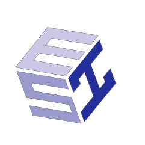

  </p
                                                                     
# IdeaESI: Interactive Software for Collecting and Developing Ideas for Educational Projects of Students and Teachers at ESI

It aims to create an interactive software application that supports idea generation and development processes, such as brainstorming and brain-writing. This tool will be specifically designed for the ESI community, including both students and teachers, to facilitate their academic and extracurricular activities. The software will allow users to create, manage, and visualize ideation projects, enhancing collaboration and innovation within the school. Key features include project creation, idea collection, idea manipulation, and various visualization tools.

## Project Specifications

For a summary of the project's requirements and objectives, please refer to [Project Specifications](https://drive.google.com/file/d/1RfsKzDTSOZYrH6dysCCorN_8MJJ4MVTP/view?usp=sharing)

## Installation

For detailed installation instructions, please refer to the [Installation Guide](https://docs.google.com/document/d/1o25zNPy5qNSoE2Z4npcKE8Y6GrqHF4j4hTgq5DEpaWw/edit?usp=sharing).

## Usage

For usage instructions and examples, please refer to the [Usage Guide](https://docs.google.com/document/d/1WRTaxTLNteHxLWwA97tcqcE5e8zr6Lvdpr0-Uv7GXog/edit?usp=sharing).

## Credits

- [Soltani Mohamed Elamine](https://github.com/soltaniamine)
- [Becharai Mohamed Khalil](https://github.com/mkhalil26)
- [Boudraa Mahdi](https://github.com/Mahdi-Boudraa)
- [Kemer Ayoub](https://github.com/youve21)
- [Bouali Rima](https://github.com/boualirima)
- [Sili Lyna Dalel](https://github.com/Sililyna)

## Acknowledgements

I would like to express my deepest gratitude to all those who have supported this project:

- **To our mentors:** Thank you for your invaluable guidance and encouragement. Your support has been instrumental in shaping this project.
- **To my teammates:** Your dedication, hard work, and discipline have been truly inspiring. This project would not have been possible without your commitment and teamwork.

Thank you all for your contributions and for believing in this project!
